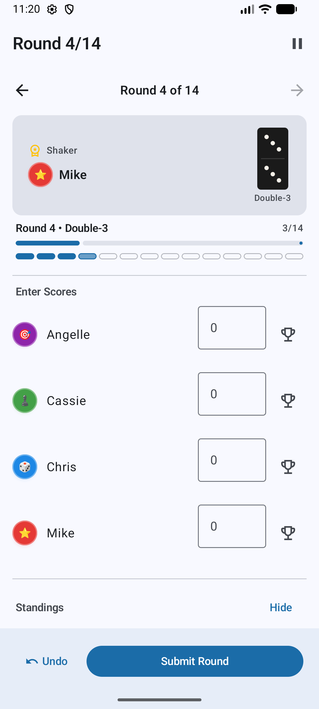

# Domino Score Tracker

Domino Score Tracker is a modern Android application designed to simplify scoring for a specific 4-player dominoes variant played "off the spinner." It provides a robust, round-by-round scoring interface, player statistics, and game history, all wrapped in a sleek Material 3 interface.

<div align="center">
  
</div>

## 🎲 The Game

The game follows a specific 14-round sequence where players score based on the dots remaining in their hand.
- **Rounds:** 14 rounds in total (Double-6 down to Double-0, then back up to Double-6).
- **Spinner:** Each round has a specific "spinner" value that dictates the play.
- **Shaker:** The "shaker" role rotates among the 4 players each round.
- **Goal:** The player with the lowest total score at the end of 14 rounds wins.

## ✨ Features

- **Player Management:** Create and customize player profiles with names, colors, and avatars.
- **Game Setup:** Easily configure new games by selecting 4 players, arranging their order, and choosing the first shaker.
- **Active Game Tracking:**
    - Clear visibility of current round, spinner value, and whose turn it is to shake.
    - Simple score entry for each player per round.
    - Live running totals and scoreboard.
    - **Undo** functionality to correct mistakes in the last round.
    - **Pause/Resume** support to pick up games later.
- **Game History:** Review all completed games with full scoreboard breakdowns.
- **Player Statistics:** Track performance over time, including games won, win percentages, average scores, and best/worst performances.
- **Material 3 Design:** A beautiful, responsive UI that supports both Light and Dark themes.

## 🛠 Tech Stack

- **Language:** [Kotlin](https://kotlinlang.org/)
- **UI Framework:** [Jetpack Compose](https://developer.android.com/jetpack/compose) with Material 3
- **Architecture:** MVVM (Model-View-ViewModel) with Clean Architecture principles
- **Dependency Injection:** [Hilt](https://developer.android.com/training/dependency-injection/hilt-android)
- **Database:** [Room](https://developer.android.com/training/data-storage/room) for local persistence
- **Navigation:** [Navigation Compose](https://developer.android.com/jetpack/compose/navigation)
- **Asynchronous Work:** [Kotlin Coroutines](https://kotlinlang.org/docs/coroutines-overview.html) & Flow
- **Build System:** Gradle Kotlin DSL with Version Catalog

## 📂 Project Structure

The project follows Clean Architecture layering to ensure maintainability and testability:

```text
app/src/main/java/com/domino/scoretracker/
├── DominoTrackerApp.kt          # Application class, Hilt setup
├── MainActivity.kt               # Entry point, Navigation host
├── data/                         # Implementation of repositories and local DB
│   ├── local/                    # Room Database, DAOs, Entities
│   ├── mapper/                   # Data-to-Domain mappers
│   └── repository/               # Repository implementations
├── domain/                       # Business logic (Pure Kotlin)
│   ├── model/                    # Domain models
│   ├── repository/               # Repository interfaces
│   └── usecase/                  # Functional business units
├── di/                           # Hilt modules
├── ui/                           # UI Layer (Jetpack Compose)
│   ├── components/               # Reusable UI widgets
│   ├── navigation/               # NavGraph and Screen definitions
│   ├── theme/                    # Material 3 colors, shapes, and typography
│   └── {home, game, player...}   # Feature-specific Screens and ViewModels
└── util/                         # Constants and helper functions
```

## 🚀 Getting Started

### Prerequisites

- Android Studio Koala or newer
- JDK 17
- Android SDK 35 (Compile SDK)

### Installation

1. Clone the repository:
   ```bash
   git clone https://github.com/yourusername/domino-score-tracker.git
   ```
2. Open the project in Android Studio.
3. Sync the project with Gradle files.
4. Run the `app` configuration on an emulator or physical device (Min SDK 26).

## 🧪 Testing

- **Unit Tests:** Business logic in the `domain` layer and `ViewModels` can be tested via JUnit.
- **Instrumentation Tests:** UI components and Room database integrations can be tested using Compose testing libraries.

Run tests via Gradle:
```bash
./gradlew test
./gradlew connectedAndroidTest
```

## 📜 License

This project is licensed under the MIT License - see the LICENSE file for details.
